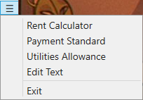

# Rent Estimator

This is a desktop application that creates a PDF handout of the estimated rent for HCV participates. In the menu there are options for updating the payment standard and utility allowance, also for modifying the header image and footer text. One more option available is the rent calculator window which shows the calculations for the current participant and allows you to see the different possible rents based on income, subsidy and utilities.

## Use

Once downloaded and executed, you will need to provide the payment standard for the desired area and utility allowance. These can be update through the the menu. You can optionally provide an image and footer text for the document.

Once the information is updated, in the main window you input the voucher size, the families annual income, the amount of dependants and whether the family is handicapped/elderly. Then you click on the create pdf button and it will use the provide information to estimate the eligible rent range and fill in the appropiate utility allowance for the family.

## Main Window

The main window has the following inputs:

**Voucher size** is the largest payment standard that the family is eligible for. This is based on the number of members in the family and other factors that the agency takes into consideration for each family or on special circumstances that merit a reasonable accomadation for that family.

**Annual income** is the total income, both earned and unearned that the family recieves. For employment gross income is used, for a business net income is used.

**Dependants** is the amount of minors in the family or full time students (excluding the head of household and spouse/partner).

**Handicap/elderly** is when the head of household or spouse/partner is either over the age of 62 (elderly) or is handicapped (based on the housing definition of handicapped). Evidence must me submit to prove the handicap status of either family member.

With the above data a families rent be estimated. The determination assures that the family is not paying more than 40% of their income in rent.

Currently the PDF produced shows the calculation used to determine the families subsidy in a format that is standard to the program, it also produces a utility page and the rent estimation page. The rent estimation page is currently an experimental page that is being tested.

The menu in the right hand corner opens the following windows: rent calculator, payment standard, utility allowance, and edit text. It also contains a button for exiting the program.

## Rent Calculator

![The rent calculator window has on the right hand side a section called reference, under this section we have two main boxes labeled: income and subsidy. Under these we have a subsection named base calculation with contains three boxes: tenant pay, forty percent, and subsidy (-income). On the right hand side we have a section named estimated rent with three boxes: the first is a combo box followed by the total rent and utilies/tenant rent boxes. Under these is the subsection names rent calcualtions with four boxes theses arranged in two even columns. These are labeled: gross rent, applicable subsidy, total HAP, and HAP to Owner.](rentcalculator.png)

**Reference** contains the base calculation for all rents and the estimated maximun rents as base on the families income and solely on the subsidy.

**Estimaded rent** contains four calculation based on the reference data. These are: Lowest with Utilities, Highest with Utilities, Lowest, and Highest. For each option the user with be able to see the total rent and the families allotted porcion of the rent they will need to pay or the remaining unused subsidy which will be paid towards the families utility bill. The user will also be able to see other related calculations to the currently selected rent option to assure accuracy or for use with manual calculations.

## Payment Standard

This window allows the user to update/change the payment standard used in the rent calculation. It permits the user to enter up to the 4 bedroom payment standard, which is a numeric value.

## Utilities Allowance

This window allows the user to update/change the utility allowance used in the rent calculation. It permits the user to manual modify each utility for each bedroom size.

## Edit Text

This window allows the user to update the header and footer of the PDF handout. The header needs to be and image while the footer is plain text.